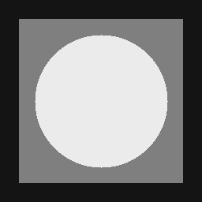
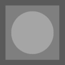
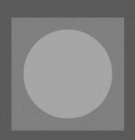
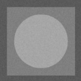
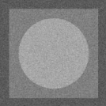
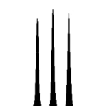
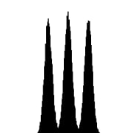
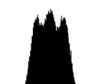
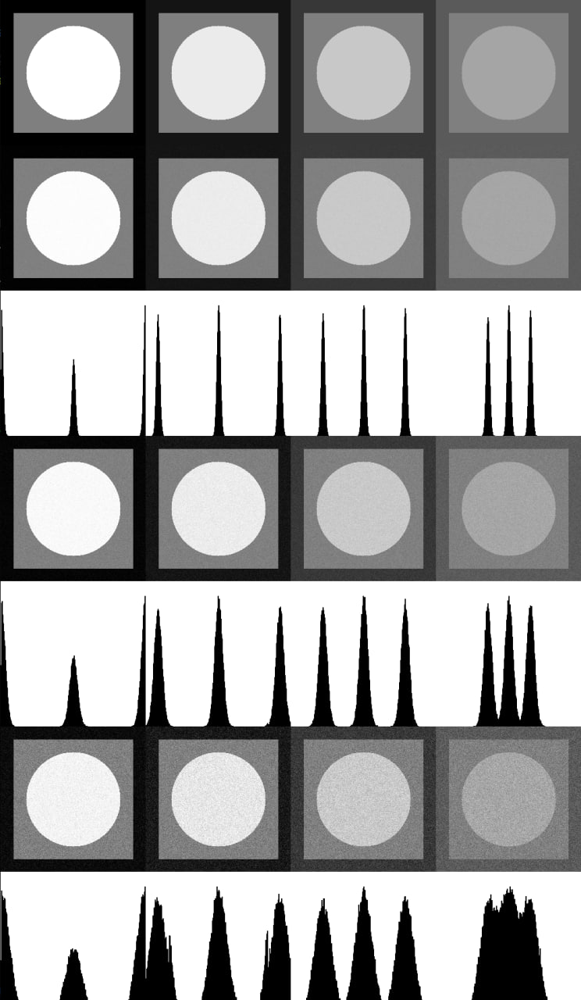

# Лабораторная 2 (гистограммы и аддитивный шум)

1. написать функцию для генерации тестового изображения с тремя уровнями яркости
(256 - сторона изображения, 209 - сторона внутреннего квадрата, 83 - радиус круга)

2. написать функцию для рисования гистограммы яркости на квадратном растре со стороной 256 в виде столбиков шириной в 1px яркости 0 на фоне 230, нормировку сделать так, чтобы максимальное значение имело высоту 230

3. написать функцию зашумления (аддитивный нормальный несмещенный шум с заданным значением среднеквадратичного отклонения)

4. сгенерировать тестовые изображения для 4-х наборов уровней и склеить слева-направо
[0,127,255]
[20,127,235]
[55,127,200]
[90,127,165]

5. сгенерировать зашумленные изображения и гистограммы, которые размещаются встык ниже тестового изображения

6. зашумление сделать для трех значений среднеквадратичного отклонения 3, 7, 15

7. склеить все изображения в одно

8. исследовать параметры шума в областях равной яркости


макет тестового изображения



# Ход работы

1) Создаем большой одноканальный ```cv::Mat```, чтоб уместить в нем изображение с разными уровнями яркости и их гистограммы.
Создаем вектор нужных значений, итерируемся по нему и на каждой итерации вызываем ```generateImage```, передавая один набор цветов. Функция возвращает ```cv::Mat```, копируем его на наше полотно в нужное место.

```cpp
int main() {
  Mat canvas = Mat::zeros(256 * 7, 256 * 4, CV_8UC1);
  vector<vector<int>> colors = {
    {0, 127, 255},
    {20, 127, 235},
    {55, 127, 200},
    {90, 127, 165}
  };
  
  int i = 0;
  for(const auto& c : colors) {
    generateImage(c).copyTo(canvas(Rect(i++ * 256, 0, 256, 256 * 7)));
  }
  

```

2) Функция ```generateImage```: 
получаем вектор цветов ```c```, создаем ```cv::Mat``` цветом ```c[0]```, считаем точки для квадрата, рисуем квадрат цветом ```c[1]``` и круг цветом ```c[2]```, возвращаем результат функции ```generateHistograms```.

```cpp
Mat generateImage(const vector<int>& c) {
  Mat image(256, 256, CV_8UC1, Scalar(c[0]));
  auto p1 = (256-209) / 2;
  auto p2 = 256 - p1;

  rectangle(image,
    Point(p1, p1),
    Point(p2, p2),
    Scalar(c[1]),
    FILLED,
    LINE_8);

  circle(image,
    Point(128, 128),
    83,
    Scalar(c[2]),
    FILLED,
    LINE_8);
    
  return generateHistograms(image);
}
  

```

## image



3) Функция ```generateHistograms```: 
создаем пустой одноканальный ```cv::Mat``` на 4 картинки и 3 гистограммы, копируем изначальное изображение вверх, которое нам передали аргументом. Итерируемся по вектору значений шума. 
В каждой итерации вызываем ```generateNoiseImage```, передавая наше ```cv::Mat``` и значение шума. Копируем полученное зашумленное изображение на полотно, вызываем ```drawHistogram``` и копируем результат опять на полотно. Возвращаем полотно.

```cpp
Mat generateHistograms(const Mat& image) {
  Mat canvas = Mat::zeros(256 * 7, 256, CV_8UC1);
  image.copyTo(canvas(Rect(0, 0, 256, 256)));

  int i = 1;
  for(const auto& c : {3., 7., 15.}) {
    Mat noisyImage = generateNoiseImage(image, c);
    noisyImage.copyTo(canvas(Rect(0, 256 * i++, 256, 256)));
    drawHistogram(noisyImage).copyTo(canvas(Rect(0, 256 * i++, 256, 256)));
  }
  
  return canvas;
}
  

```

## возвращаемое изображение


4) Функция ```generateNoiseImage```: 
с помощью библиотеки ```<random>``` создаем генератор нормального распределения от ```1``` до ```c```. Клонируем оригинальное изображение. Итерируемся в цикле по всем пикселям клонированного изображения, считаем шум и прибавляем его к каждому пикселю, учитывая выходы за границы.
Возвращаем зашумленное изображение.

```cpp
Mat generateNoiseImage(const Mat& image, const double& c) {
  random_device rd{};
  mt19937 gen{rd()};
  normal_distribution<> distribution{1., c};
  Mat noisyImage = image.clone();

  for (int i = 0; i < noisyImage.rows; i++) {
    for (int j = 0; j < noisyImage.cols; j++) {
      auto noise = round(distribution(gen));
      auto diff = static_cast<int>(noisyImage.at<uchar>(i, j)) + noise;
      
      diff < 0 || diff > 255 ? 
        noisyImage.at<uchar>(i, j) -= static_cast<uchar>(noise) : 
        noisyImage.at<uchar>(i, j) += static_cast<uchar>(noise);
    }
  }

  return noisyImage;
}
  

```

## шумные изображения





4) Функция ```drawHistogram```: 
вызываем функцию ```calcHist```, передавая аргументом ссылку на наше изображение, гистограмму которого нужно посчитать, кол-во изображений, список каналов затемнения, маску, размерность гистограммы, размер гистограммы, границы гистограммы, uniform(стандартное значение), accumulate(стандартное значение).
Нормализуем гистограмму от ```0``` до ```230```.
Рисуем гистограмму и возвращаем ее.


```cpp
Mat drawHistogram(const Mat& noisyImage) {
  Mat histImage;
  int histSize = 256;
  float range[] = {0, 256};
  const float *histRange[] = {range};

  Mat hist;
  calcHist(&noisyImage, 1, 0, Mat(), hist, 1, &histSize, histRange, 1, 0);

  int w = 256;
  int bin_w = cvRound((double) w / histSize);
  histImage = Mat(w, w, CV_8UC1, Scalar(255));
  normalize(hist, hist, 0, 230, NORM_MINMAX, -1, Mat());

  for (int i = 1; i < histSize; i++) {
    rectangle(histImage,
      Point(bin_w * (i - 1), w),
      Point(bin_w * i, w - cvRound(hist.at<float>(i - 1))),
      Scalar(0),
      FILLED);
  }

  return histImage;
}
  

```

## гистограммы шумных изображений





5) Создаем окно и выводим полотно.

```cpp

  namedWindow("Image", WINDOW_NORMAL);
  resizeWindow("Image", 256 * 4, 256 * 7);
  imshow("Image", canvas);
  waitKey(0);

  return 0;
}
  

```




# Пример использования
```bash
./../bin/lab02
```