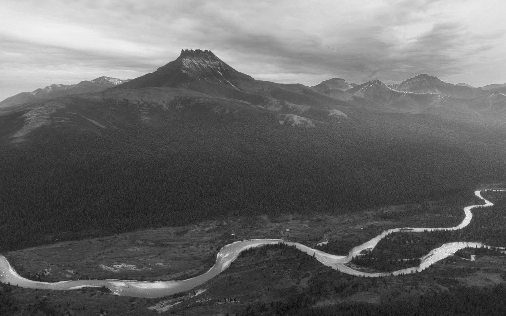
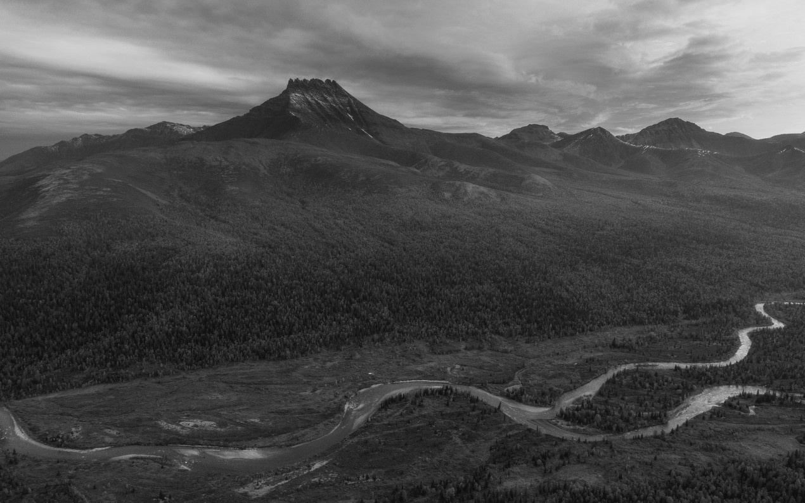
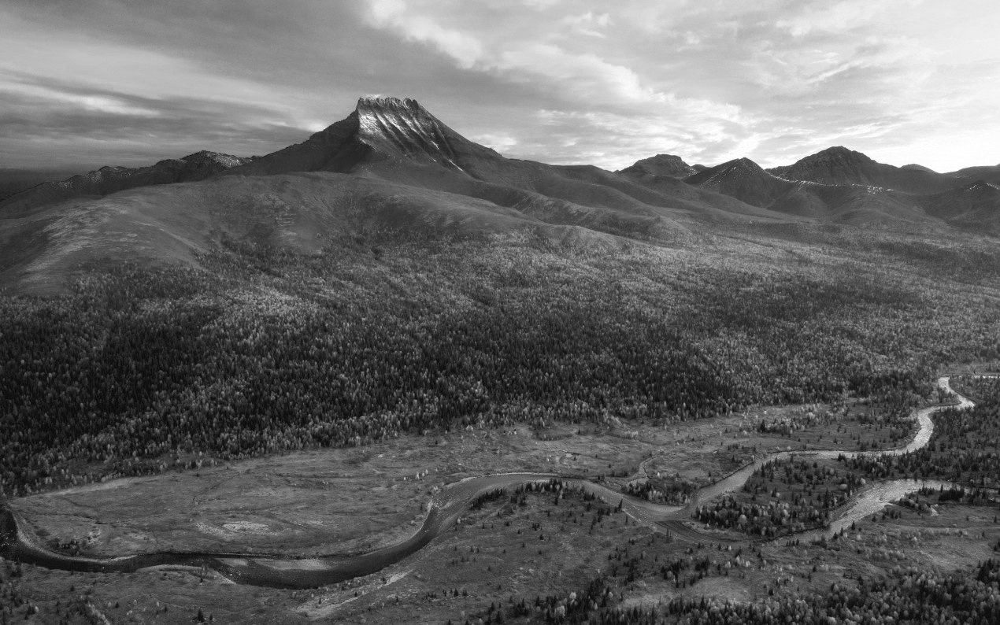

# Лабораторная 3 (автоконтраст)

1. написать функцию для автоконтрастирования по квантилям черного и белого

2. написать функции для автоконтрастирования цветного изображения (поканально и совместно)

3. оформить в виде консольного приложения (тип входного изображения определять автоматически)

4. подобрать тестовые изображения

5. написать короткий отчет

# Ход работы

1) Используем ```cv::CommandLineParser``` для парсинга аргументов. Проверяем путь, квантили и возможность чтения изображения.
Вызываем ```chooseMethod``` для выбора метода на основе канальности изображения.
После выбора метода вызывается нужная функция ```autocontrast```.
Вертикальная конкатенация и открытие изображения в окне.

```cpp
int main(int argc, char* argv[]) {
  cv::CommandLineParser parser(argc, argv,
    "{ path |  | path to image }"
    "{ q1 | 0.0 | left quantile }"
    "{ q2 | 1.0 | right quantile }");

  if(!parser.has("path")) {
    std::cerr << "No image path" << std::endl;
    return 0;
  }

  const auto path = parser.get<std::string>("path");
  const std::pair<double, double> q = {parser.get<double>("q1"), parser.get<double>("q2")};

  if(q.first > q.second) {
    std::cerr << "Left quantile is bigger than right quantile" << std::endl;
    return 0;
  }

  std::vector<cv::Mat> canvases(2);
  try {
    canvases[0] = cv::imread(path);  
  } catch(const std::exception& e) {
    std::cerr << "Error while reading image: " << e.what() << std::endl;
    return 0;  
  }

  std::function<void(cv::Mat&, cv::Mat&, const std::pair<double, double>&)> autocontrast;
  chooseMethod(canvases[0], autocontrast);
  autocontrast(canvases[0], canvases[1], q);

  cv::Mat canvas;
  cv::vconcat(canvases, canvas);

  cv::namedWindow("Image", cv::WINDOW_NORMAL);
  cv::resizeWindow("Image", 1200, 1200);
  cv::imshow("Image", canvas);
  cv::waitKey(0);

  return 0;
}
  

```

2) Функция ```chooseMethod```:
Проверяем канальность изображения и дополнительно проходимся по всем пикселям, если вдруг изображение неодноканальное, но в чб цвете.


```cpp
void chooseMethod(cv::Mat image, std::function<void(cv::Mat&, cv::Mat&, 
  const std::pair<double, double>&)>& method) {
  if(image.channels() == 1) {
    method = autocontrast1;
  } else {
    bool is1Channel = true;
    for(int i = 0; i < image.rows; i++) {
      for(int j = 0; j < image.cols; j++) {
        cv::Vec3b pixel = image.at<cv::Vec3b>(i, j);
        if(pixel[0] != pixel[1] || pixel[0] != pixel[2]) {
          is1Channel = false;
          break;
        }
      }
    }

    is1Channel ? method = autocontrast1 : method = autocontrast3;
  }
}
  

```

3) Функция ```autocontrast1```:
Выбирается при одноканальном изображении. В функции мы переводим изображение в чб, вызываем функцию ```getBorders```, получаем границы и вызываем ```normalize``` с полученными раннее границами.


```cpp
void autocontrast1(cv::Mat& image, cv::Mat& canvas, 
  const std::pair<double, double>& q) {
  cv::cvtColor(image, canvas, cv::COLOR_BGR2GRAY);
  std::pair<int, int> borders;
  getBorders(canvas, q, borders);
  cv::normalize(canvas, canvas, borders.first, borders.second, cv::NORM_MINMAX);
  cv::cvtColor(canvas, canvas, cv::COLOR_GRAY2BGR);
}
  

```

пример:
оригинал и ниже после нормализации на основе полученных границ


4) Функция ```autocontrast3```:
Выбирается при трехканальном изображении. В функции создаются 3 вектора размером 3 для каждого канала изображения. Сплитим изначальное изображение в один из векторов, получаем границы для каждого из каналов через ```getBorders```, нормализуем каждый канал двумя способами, через максимальную и минимальную границу среди границ всех каналов и через границы каждого канала. Объединяем в одно изображение.


```cpp
void autocontrast3(cv::Mat& image, cv::Mat& canvas, 
  const std::pair<double, double>& q) {

  std::vector<cv::Mat> imageVec, combined(3), separated(3);
  cv::split(image, imageVec);

  std::vector<std::pair<int, int>> borders(3);
  for(int i = 0; i < 3; i++) {
    getBorders(imageVec[i], q, borders[i]);
  }

  for(int i = 0; i < 3; i++) {
    cv::normalize(imageVec[i], combined[i], minMax.first, minMax.second, cv::NORM_MINMAX);
    cv::normalize(imageVec[i], separated[i], borders[i].first, borders[i].second, cv::NORM_MINMAX);
  }

  std::vector<cv::Mat> canvases(2);
  cv::merge(combined, canvases[0]);
  cv::merge(separated, canvases[1]);
  cv::vconcat(canvases, canvas);
}
  

```

Изображение после split






4) Функция ```getBorders```:
На входе получаем изображение и квантили. Делаем гистограмму полученного изображения, проходимся по гистограмме и находим левую и правую границу на основе квантилей. Записываем глобальные и локальные минимум и максимум границы.


```cpp
void getBorders(cv::Mat& image, const std::pair<double, double>& q, 
  std::pair<int, int>& borders) {
  cv::Mat hist;
  int histSize = 256;
  float range[] = {0, 256};
  const float* histRange = {range};
  cv::calcHist(&image, 1, 0, cv::Mat(), hist, 1, &histSize, &histRange, 1, 0);

  float total = cv::sum(hist)[0];
  float sumLeft = 0, sumRight = 0;
  borders = {0, 255};

  for(int i = 0, j = histSize - 1; i < histSize || j >= 0; i++, j--) {
    sumLeft += hist.at<float>(i);
    sumRight += hist.at<float>(j);

    if(q.first <= sumLeft / total && i < histSize) {
      borders.first = i;
      i = histSize;
    }
    if(1 - q.second <= sumRight / total && j >= 0) {
      borders.second = j;
      j = -1;
    }
  }

  minMax = {std::min(borders.first, minMax.first), std::max(borders.second, minMax.second)};
}
  

```


## несколько примеров работы

Порядок склеенных изображений:
в случае чб изображения:
- 1)оригинал
- 2)с автоконтрастом

в случае ргб изображения:
- 1)оригинал
- 2)с автоконстрастом совместно
- 3)с автоконстрастом поканально


```bash
../bin/lab03 -path=../prj.lab/lab03/2.jpg -q1=0.99 -q2=1
```


```bash
../bin/lab03 -path=../prj.lab/lab03/2.jpg -q1=0.1 -q2=0.9
```


```bash
../bin/lab03 -path=../prj.lab/lab03/1.jpg -q1=0.4 -q2=0.6
```


```bash
../bin/lab03 -path=../prj.lab/lab03/1.jpg -q2=0.05
```
