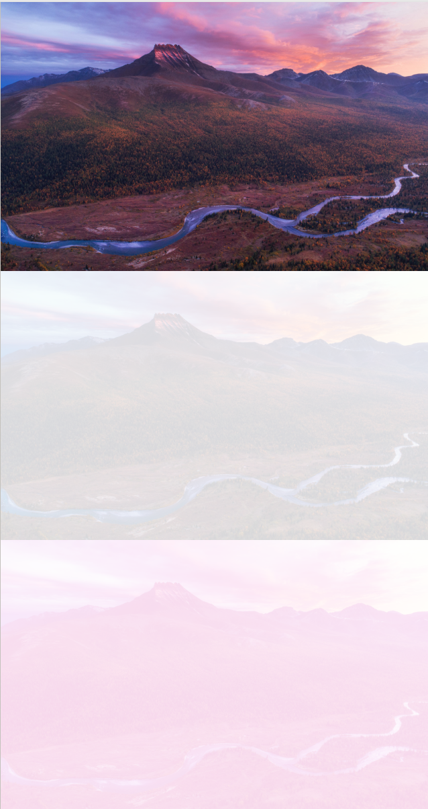
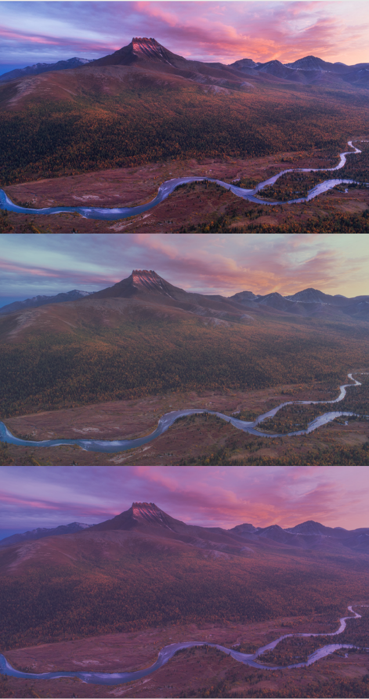
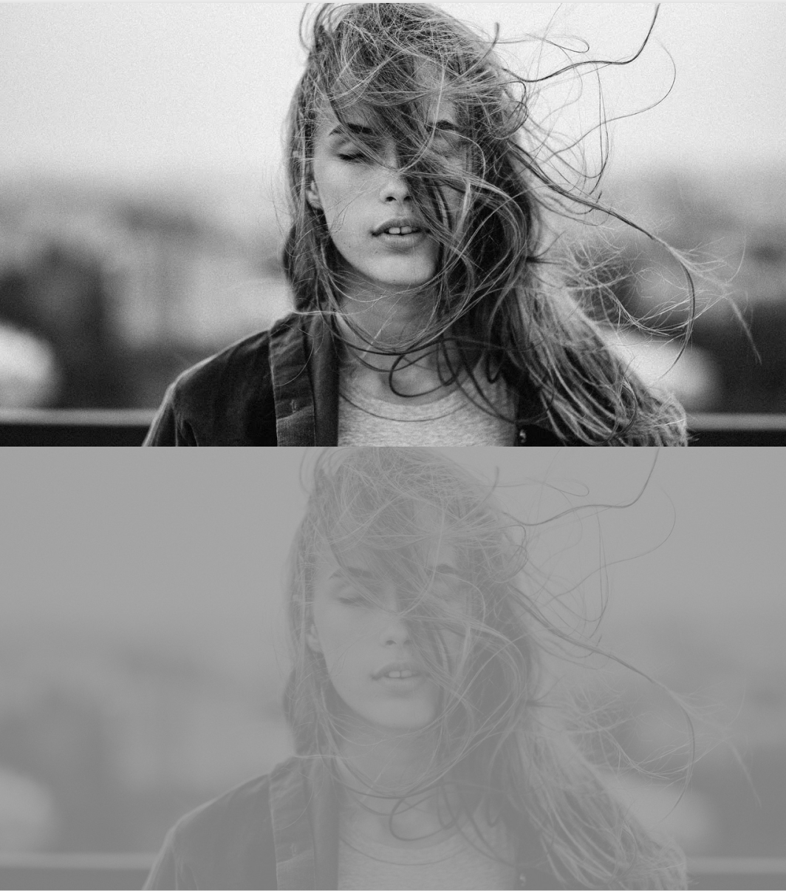
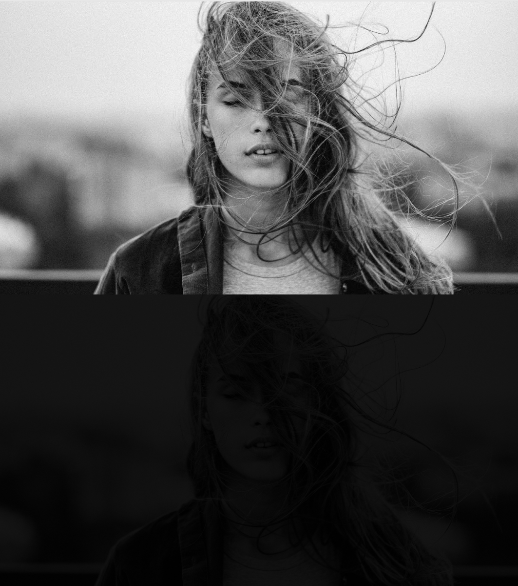

# Лабораторная 3 (автоконтраст)

1. написать функцию для автоконтрастирования по квантилям черного и белого

2. написать функции для автоконтрастирования цветного изображения (поканально и совместно)

3. оформить в виде консольного приложения (тип входного изображения определять автоматически)

4. подобрать тестовые изображения

5. написать короткий отчет

# Ход работы

1) Используем ```cv::CommandLineParser``` для парсинга аргументов. Проверяем путь, квантили и возможность чтени изображения.
Вызываем ```chooseMethod``` для выбора метода на основе канальности изображения.
После выбора метода вызывается нужная функция ```autocontrast```.
Вертикальная конкатенация и открытие изображения в окне.

```cpp
int main(int argc, char* argv[]) {
  cv::CommandLineParser parser(argc, argv,
    "{ path |  | path to image }"
    "{ q1 | 0.0 | left quantile }"
    "{ q2 | 1.0 | right quantile }");

  if(!parser.has("path")) {
    std::cerr << "No image path" << std::endl;
    return 0;
  }

  const auto path = parser.get<std::string>("path");
  const std::pair<double, double> q = {parser.get<double>("q1"), parser.get<double>("q2")};

  if(q.first > q.second) {
    std::cerr << "Left quantile is bigger than right quantile" << std::endl;
    return 0;
  }

  std::vector<cv::Mat> canvases(2);
  try {
    canvases[0] = cv::imread(path);  
  } catch(const std::exception& e) {
    std::cerr << "Error while reading image: " << e.what() << std::endl;
    return 0;  
  }

  std::function<void(cv::Mat&, cv::Mat&, const std::pair<double, double>&)> autocontrast;
  chooseMethod(canvases[0], autocontrast);
  autocontrast(canvases[0], canvases[1], q);

  cv::Mat canvas;
  cv::vconcat(canvases, canvas);

  cv::namedWindow("Image", cv::WINDOW_NORMAL);
  cv::resizeWindow("Image", 1200, 1200);
  cv::imshow("Image", canvas);
  cv::waitKey(0);

  return 0;
}
  

```

2) Функция ```chooseMethod```:


```cpp
void chooseMethod(cv::Mat image, std::function<void(cv::Mat&, cv::Mat&, 
  const std::pair<double, double>&)>& method) {
  if(image.channels() == 1) {
    method = autocontrast1;
  } else {
    bool is1Channel = true;
    for(int i = 0; i < image.rows; i++) {
      for(int j = 0; j < image.cols; j++) {
        cv::Vec3b pixel = image.at<cv::Vec3b>(i, j);
        if(pixel[0] != pixel[1] || pixel[0] != pixel[2]) {
          is1Channel = false;
          break;
        }
      }
    }

    is1Channel ? method = autocontrast1 : method = autocontrast3;
  }
}
  

```


Все изображения, которые, я использовал для тестов лежат в /examples

## флаги
- path |  | path to image
- q1 | 0.0 | left quantile
- q2 | 1.0 | right quantile

## демонтрация примеров
Изображения выводятся вместе
в случае чб изображения:
- 1)оригинал
- 2)с автоконтрастом

в случае ргб изображения:
- 1)оригинал
- 2)с автоконстрастом совместно
- 3)с автоконстрастом поканально

создаем папку ```build```, переходим в нее, пишем ```cmake .. && make```
все команды я запускал из ```build```

```bash
../bin/lab03 -path=../prj.lab/lab03/2.jpg -q1=0.99 -q2=1
```


```bash
../bin/lab03 -path=../prj.lab/lab03/2.jpg -q1=0.1 -q2=0.9
```


```bash
../bin/lab03 -path=../prj.lab/lab03/1.jpg -q1=0.4 -q2=0.6
```


```bash
../bin/lab03 -path=../prj.lab/lab03/1.jpg -q2=0.05
```
