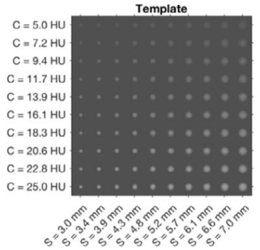
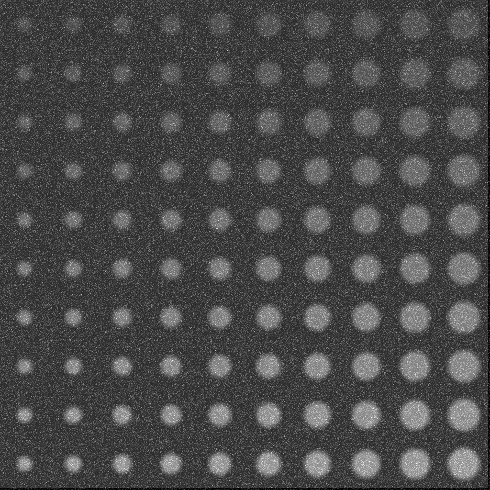
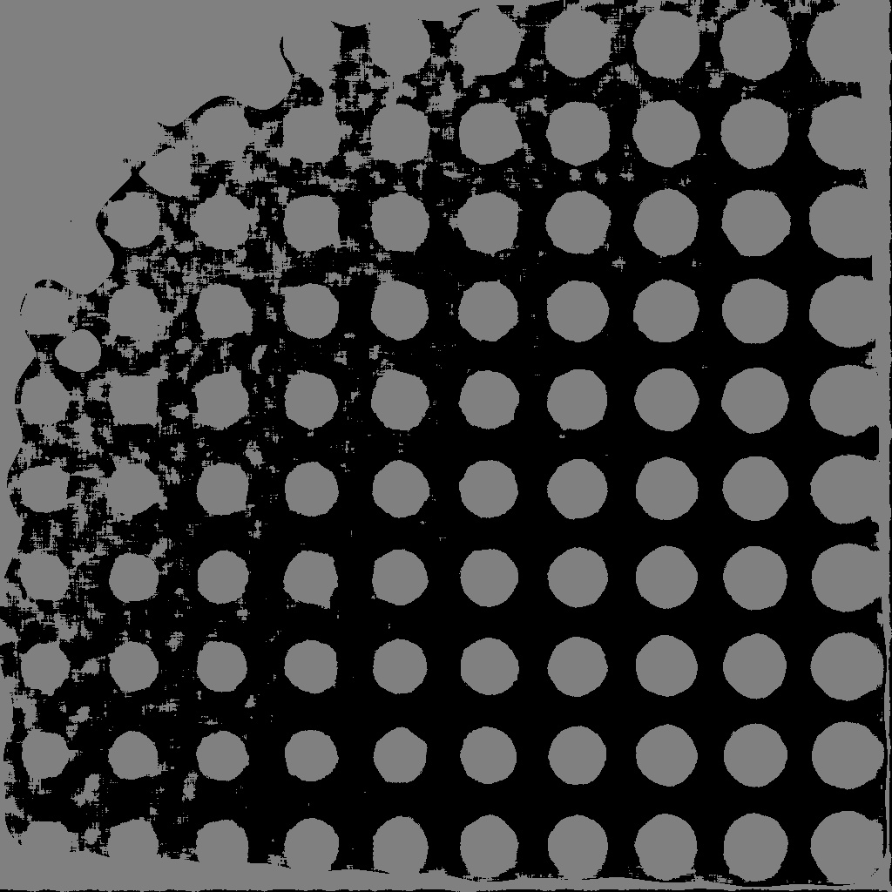
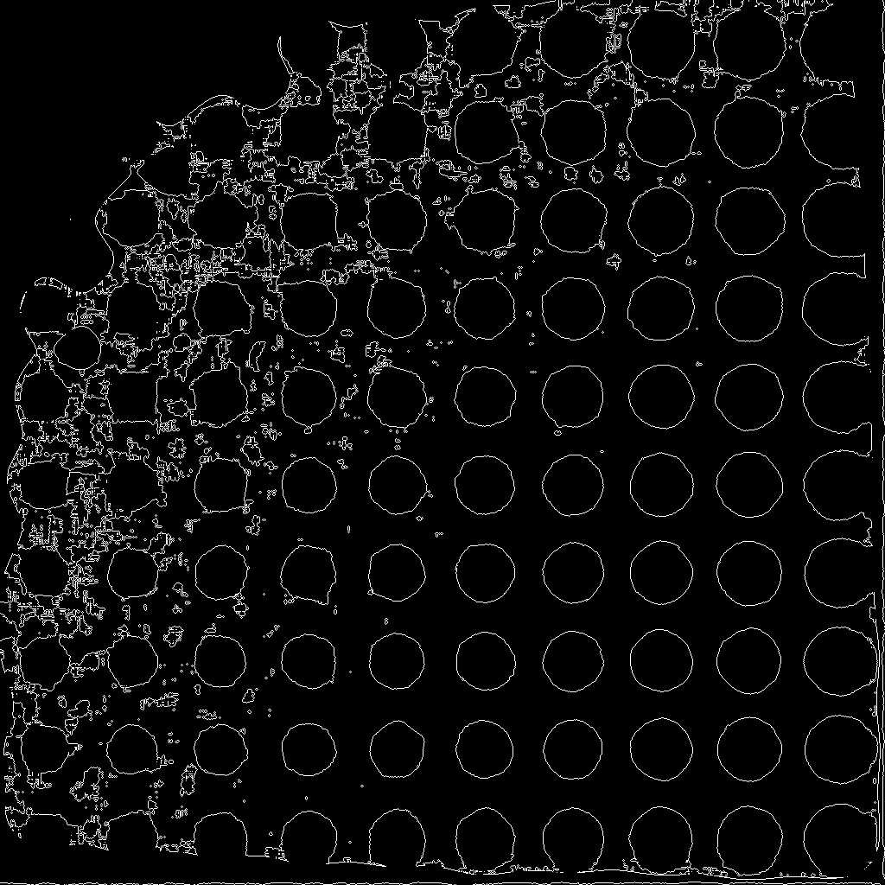

# Лабораторная 4 (бинаризация и простое детектирование объектов)

1. написать функцию для генерации тестового изображения (количество объектов интереса, диапазон размеров, значений контраста и степени размытости - параметры)

2. написать несколько вариантов бинаризации (параметризованной)

3. предусмотреть режим визуальной настройки параметров бинаризации (движки в GUI)

4. написать функционал для детектирования

5. написать функционал для оценки качества (на основе IoU при заданном уровне сделать подсчет количества TP, FP и FN детекций)

Пример тестового изображения



# Ход работы

1) Парсим аргументы и проверяем правильные ли они.

```cpp
std::pair<double, double> getPair(const std::string& str) {
  double l, r;
  std::istringstream iss(str);
  char separator;
  if(!(iss >> l >> separator >> r) || separator != '-') {
    throw std::invalid_argument("Invalid string format");
  }
  return {l, r};
}

int main(int argc, char* argv[]) {
  cv::CommandLineParser parser(argc, argv,
    "{ a | 100 | amount of objects(must be square number) }"
    "{ s | 3.0-7.0 | borders of object's size(mm) }"
    "{ c | 5.0-25.0 | borders of contrast ratio(HU) }"
    "{ b | 0.0 | blur }");

  const auto a = parser.get<int>("a");
  if(a <= 0) std::cerr << "amount of objects(a) must be positive" << std::endl;
  if(std::pow((int)std::sqrt(a), 2) != a)  std::cerr << "amount of objects(a) must be square number" << std::endl;
  const auto b = parser.get<int>("b");
  if(b < 0) std::cerr << "blur(b) must not be negative" << std::endl;

  std::pair<double, double> s, c;
  try {
    s = getPair(parser.get<std::string>("s"));
    c = getPair(parser.get<std::string>("c"));
  } catch(const std::invalid_argument& e) {
    std::cerr << "error while parsing variables: " << e.what() << std::endl;
  }
  

```

2) Генерируем изображение через функцию ```generate``` с полученными аргументами, записываем его в файл, получаем трешхолд, записываем в файл, ищем кружки и записываем в файл.

```cpp
  cv::Mat canvas(1024, 1024, CV_8UC1, cv::Scalar(127));
  cv::Mat object;
  generate(canvas, object, a, b, s, c);
  cv::namedWindow("Image", cv::WINDOW_NORMAL);
  cv::imshow("Image", canvas);
  cv::imwrite("Lab04img01.jpeg", canvas);

  cv::Mat tresholdCanvas = canvas;
  getTreshold(tresholdCanvas);
  cv::namedWindow("Image treshhold", cv::WINDOW_NORMAL);
  cv::imshow("Image treshhold", tresholdCanvas);
  cv::imwrite("Lab04img02.jpeg", tresholdCanvas);

  cv::Mat blobsCanvas = canvas;
  getBlobs(blobsCanvas);
  cv::namedWindow("Image blobs", cv::WINDOW_NORMAL);
  cv::imshow("Image blobs", blobsCanvas);
  cv::imwrite("Lab04img03.jpeg", blobsCanvas);


  cv::waitKey(0);

  return 0;
}
  

```

3) Функция ```generate```:
Проходимся по изображению, считаем радиусы кружков и их контраст, вызываем ```addBlur``` на каждой итерации для создания кружочка и добавления блюра. После цикла добавляем шум и нормализуем.

```cpp
void generate(cv::Mat& canvas, cv::Mat& object, int a, int b, std::pair<double, double>& s, std::pair<double, double>& c) {
  int rows = std::sqrt(a);
  double sizeStep = (s.second - s.first) / rows;
  double contrastStep = (c.second - c.first) / rows;
  object = cv::Mat(1024, 1024, CV_8UC1, cv::Scalar(127));

  for(int i = 0; i < rows; i++) {
    double currentSize = s.first + i * sizeStep;
    for(int j = 0; j < rows; j++) {
      double currentContrast = c.first + j * contrastStep;
      int y = (object.cols / rows) * j + object.cols / (2 * rows);
      int x = (object.rows / rows) * i + object.rows / (2 * rows);
      int radius = currentSize * (object.cols / 100) / 2;
      int intensity = 154 + currentContrast * (255 / 100);

      addBlur(object, x, y, radius, contrastStep, rows, intensity);
      // addBlur(object, x, y, radius, contrastStep, rows, 100);
    }
  }

  cv::Mat  noisedImage = object;
  cv::Mat mGaussian_noise = cv::Mat(object.size(),CV_8UC1);

  cv::randn(mGaussian_noise, 0, 20);
  noisedImage += mGaussian_noise;
  normalize(noisedImage,noisedImage, 0, 255, cv::NORM_MINMAX, CV_8UC1);

  canvas = noisedImage;
}
  

```


4) Функция ```addBlur```:
Рисуем кружки с нужной контрастностью, размером и координатами, добавляем блюр, копируем на наше изображение.

```cpp
void addBlur(cv::Mat& image, int x, int y, int radius, int blur, int cols, int intensity) {
  int circleImgWidth = image.cols / cols;
  cv::Mat circleImage(circleImgWidth, circleImgWidth, CV_8UC1, cv::Scalar(150));
  
  cv::circle(circleImage, cv::Point(circleImgWidth / 2, circleImgWidth / 2), radius, cv::Scalar(intensity), -1);
  int kernelSize = blur * 6 + 1;
  cv::blur(circleImage, circleImage, cv::Size(kernelSize, kernelSize));
  
  circleImage.copyTo(image(cv::Rect(x - circleImgWidth / 2, y - circleImgWidth / 2, circleImgWidth, circleImgWidth)));
}


```



5) Функция ```getTreshold```:
Рисуем кружки с нужной контрастностью, размером и координатами, добавляем блюр, копируем на наше изображение.

```cpp
void getTreshold(cv::Mat& canvas) {
  cv::medianBlur(canvas, canvas, 15);

  cv::adaptiveThreshold(canvas, 
    canvas, 
    64 * 2, 
    cv::ADAPTIVE_THRESH_GAUSSIAN_C, 
    cv::THRESH_BINARY, 
    255, 
    7);
}


```




5) Функция ```getBlobs```:
Лапласиан.

```cpp
void getBlobs(cv::Mat& image) {
  cv::Laplacian(image, image, CV_8UC1);
  cv::threshold(image, image, 0, 255, cv::THRESH_BINARY);
}


```



6) Оценки качества нет.

Если делать черные кружки на белом фоне, то кружки детектятся отлично, потому что хорошо отрабатывает трешхолд, но при светлосерых кружках на сером фоне при большом количестве шума работает плохо, детектится шум вместо кружков и самые маленькие кружки превращаются в один большой blob.