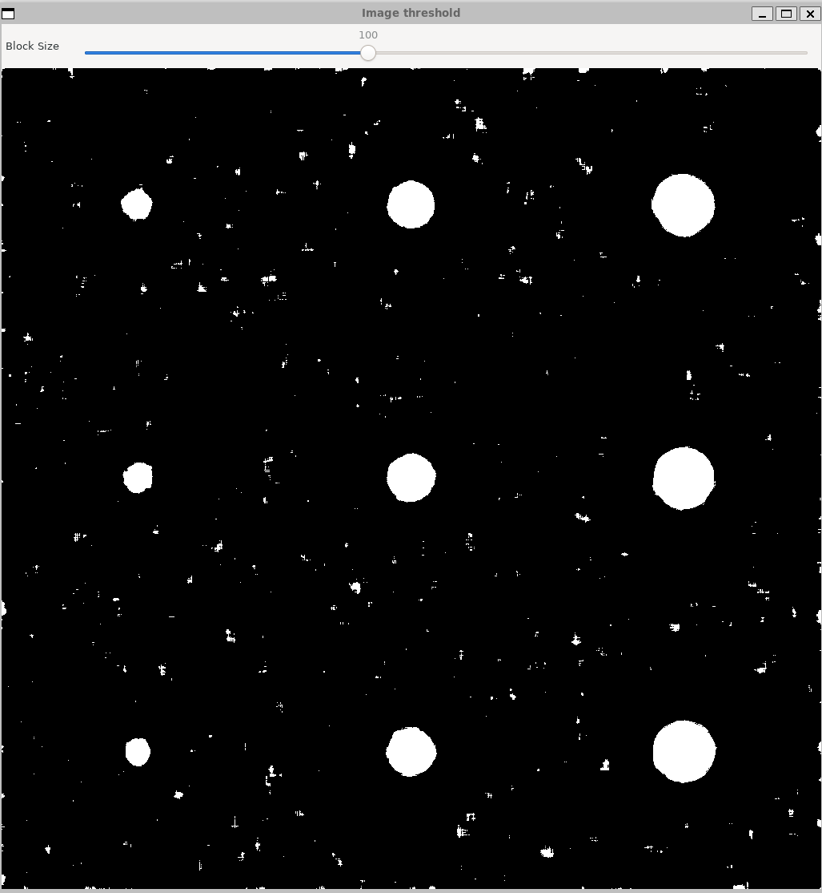

# Лабораторная 4 (бинаризация и простое детектирование объектов)

1. написать функцию для генерации тестового изображения (количество объектов интереса, диапазон размеров, значений контраста и степени размытости - параметры)

2. написать несколько вариантов бинаризации (параметризованной)

3. предусмотреть режим визуальной настройки параметров бинаризации (движки в GUI)

4. написать функционал для детектирования

5. написать функционал для оценки качества (на основе IoU при заданном уровне сделать подсчет количества TP, FP и FN детекций)

Пример тестового изображения


# Ход работы

1) GUI

Настройка:

|Название|Назначение|
|-|-|
|A|Количество объектов|
|S Low|Нижняя граница размера круга|
|S High|Верхняя граница размеров круга|
|C Low|Нижняя граница контрастности|
|C high|Верхняя граница контрастности|
|B|Коэффициент блюра|
|Noise level|Уровень шума|
|Block Size|Параметр для AdaptiveThreshold|


2) При изменении любого параметра в GUI происходит генерация изображения по заданным параметрам, детекция и оценка. Оценка выводится в консоль в виде:

```
Threshold: 0, TP: 84, FP: 186, FN: 16, IoU: 0.293706
Threshold: 0.1, TP: 84, FP: 186, FN: 16, IoU: 0.293706
Threshold: 0.2, TP: 84, FP: 186, FN: 16, IoU: 0.293706
Threshold: 0.3, TP: 84, FP: 186, FN: 16, IoU: 0.293706
Threshold: 0.4, TP: 84, FP: 186, FN: 16, IoU: 0.293706
Threshold: 0.5, TP: 84, FP: 186, FN: 16, IoU: 0.293706
Threshold: 0.6, TP: 84, FP: 186, FN: 16, IoU: 0.293706
Threshold: 0.7, TP: 84, FP: 186, FN: 16, IoU: 0.293706
Threshold: 0.8, TP: 84, FP: 186, FN: 16, IoU: 0.293706
Threshold: 0.9, TP: 83, FP: 187, FN: 17, IoU: 0.289199
Threshold: 1, TP: 83, FP: 187, FN: 17, IoU: 0.289199
```

Так же после каждой генерации сохраняется конфиг в ```config.json```.

Блюр, цвет, уровень шума, размеры изображения.
В объекты сохраняется контрастность, координаты и радиус.

```json
{
    "data": {
        "background": {
            "blur": 50,
            "color": 127,
            "noise": 18,
            "size": [
                1024,
                1024
            ]
        },
        "objects": [
            {
                "c": 156,
                "p": [
                    51,
                    51,
                    5
                ]
            },

            //<...>

            {
                "c": 194,
                "p": [
                    969,
                    867,
                    36
                ]
            },
            {
                "c": 199,
                "p": [
                    969,
                    969,
                    36
                ]
            }
        ]
    }
}
```

После каждой генерации сохраняется результат детекции в ```detection_result.png```

2) Рассмотрим детальнее работу программы.

При изменении любого параметра вызывается ```onTrackbarChange```.
Внутри данной функции вызывается функция генерации изображения по параметрам ```generateAndProcess```, сразу при генерации мы записываем в ```groundTruthBlobs``` изначальные параметры каждого объекта для последующей оценки. 

Сгенерированное изображение(параметры как в скриншоте с параметрами) :


Делаем бинаризацию через ```getThreshold``` .


Детектим объекты через ```makeDoGDetection```, у нас сохраняется изображение.


В конце вызывается оценка качества через ```evaluateDetection```, в консоль выводится:

```
Threshold: 0, TP: 84, FP: 186, FN: 16, IoU: 0.293706
Threshold: 0.1, TP: 84, FP: 186, FN: 16, IoU: 0.293706
Threshold: 0.2, TP: 84, FP: 186, FN: 16, IoU: 0.293706
Threshold: 0.3, TP: 84, FP: 186, FN: 16, IoU: 0.293706
Threshold: 0.4, TP: 84, FP: 186, FN: 16, IoU: 0.293706
Threshold: 0.5, TP: 84, FP: 186, FN: 16, IoU: 0.293706
Threshold: 0.6, TP: 84, FP: 186, FN: 16, IoU: 0.293706
Threshold: 0.7, TP: 84, FP: 186, FN: 16, IoU: 0.293706
Threshold: 0.8, TP: 84, FP: 186, FN: 16, IoU: 0.293706
Threshold: 0.9, TP: 83, FP: 187, FN: 17, IoU: 0.289199
Threshold: 1, TP: 83, FP: 187, FN: 17, IoU: 0.289199
```


и конфигурация сохраняется в ```config.json```

# Несколько запусков с разными параметрами

1)


```
Threshold: 0, TP: 49, FP: 221, FN: 0, IoU: 0.181481
Threshold: 0.1, TP: 49, FP: 221, FN: 0, IoU: 0.181481
Threshold: 0.2, TP: 49, FP: 221, FN: 0, IoU: 0.181481
Threshold: 0.3, TP: 49, FP: 221, FN: 0, IoU: 0.181481
Threshold: 0.4, TP: 49, FP: 221, FN: 0, IoU: 0.181481
Threshold: 0.5, TP: 49, FP: 221, FN: 0, IoU: 0.181481
Threshold: 0.6, TP: 49, FP: 221, FN: 0, IoU: 0.181481
Threshold: 0.7, TP: 49, FP: 221, FN: 0, IoU: 0.181481
Threshold: 0.8, TP: 49, FP: 221, FN: 0, IoU: 0.181481
Threshold: 0.9, TP: 49, FP: 221, FN: 0, IoU: 0.181481
Threshold: 1, TP: 49, FP: 221, FN: 0, IoU: 0.181481
```

2)


```
Threshold: 0, TP: 64, FP: 206, FN: 0, IoU: 0.237037
Threshold: 0.1, TP: 64, FP: 206, FN: 0, IoU: 0.237037
Threshold: 0.2, TP: 64, FP: 206, FN: 0, IoU: 0.237037
Threshold: 0.3, TP: 64, FP: 206, FN: 0, IoU: 0.237037
Threshold: 0.4, TP: 64, FP: 206, FN: 0, IoU: 0.237037
Threshold: 0.5, TP: 64, FP: 206, FN: 0, IoU: 0.237037
Threshold: 0.6, TP: 64, FP: 206, FN: 0, IoU: 0.237037
Threshold: 0.7, TP: 64, FP: 206, FN: 0, IoU: 0.237037
Threshold: 0.8, TP: 64, FP: 206, FN: 0, IoU: 0.237037
Threshold: 0.9, TP: 64, FP: 206, FN: 0, IoU: 0.237037
Threshold: 1, TP: 64, FP: 206, FN: 0, IoU: 0.237037
```
3)


```
Threshold: 0, TP: 25, FP: 245, FN: 0, IoU: 0.0925926
Threshold: 0.1, TP: 25, FP: 245, FN: 0, IoU: 0.0925926
Threshold: 0.2, TP: 25, FP: 245, FN: 0, IoU: 0.0925926
Threshold: 0.3, TP: 25, FP: 245, FN: 0, IoU: 0.0925926
Threshold: 0.4, TP: 25, FP: 245, FN: 0, IoU: 0.0925926
Threshold: 0.5, TP: 25, FP: 245, FN: 0, IoU: 0.0925926
Threshold: 0.6, TP: 25, FP: 245, FN: 0, IoU: 0.0925926
Threshold: 0.7, TP: 25, FP: 245, FN: 0, IoU: 0.0925926
Threshold: 0.8, TP: 25, FP: 245, FN: 0, IoU: 0.0925926
Threshold: 0.9, TP: 25, FP: 245, FN: 0, IoU: 0.0925926
Threshold: 1, TP: 25, FP: 245, FN: 0, IoU: 0.0925926
```
4)





```
Threshold: 0, TP: 9, FP: 246, FN: 0, IoU: 0.0352941
Threshold: 0.1, TP: 9, FP: 246, FN: 0, IoU: 0.0352941
Threshold: 0.2, TP: 9, FP: 246, FN: 0, IoU: 0.0352941
Threshold: 0.3, TP: 9, FP: 246, FN: 0, IoU: 0.0352941
Threshold: 0.4, TP: 9, FP: 246, FN: 0, IoU: 0.0352941
Threshold: 0.5, TP: 9, FP: 246, FN: 0, IoU: 0.0352941
Threshold: 0.6, TP: 9, FP: 246, FN: 0, IoU: 0.0352941
Threshold: 0.7, TP: 9, FP: 246, FN: 0, IoU: 0.0352941
Threshold: 0.8, TP: 9, FP: 246, FN: 0, IoU: 0.0352941
Threshold: 0.9, TP: 9, FP: 246, FN: 0, IoU: 0.0352941
Threshold: 1, TP: 9, FP: 246, FN: 0, IoU: 0.0352941
```
# Пример запуска

```bash
./../bin/lab04
```