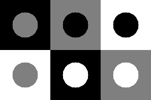
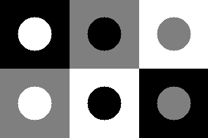
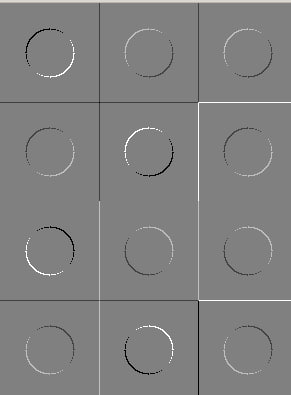
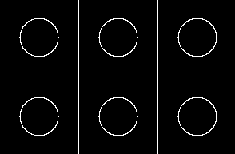
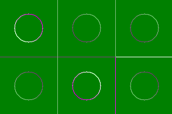

# Лабораторная 5 (фильтрация)

1. написать функцию для генерирования всех вариантов круга на фоне квадрата (для уровней серого 0, 127, 255)
- размер квадрата - 99, радиус круга - 25, круг в центре квадрата
- квадраты образуют прямоугольник (3 столбца, 2 строки)

примерный результат



2. задать "руками" два ядра для линейной фильтрации
+1 0      0 +1
 0 -1 и  -1  0

3. получить изображения I1 и I2 линейной фильтрацией с указанными ядрами

4. получить изображение I3 = sqrt(I1 * I1 + I2 * I2)

5. получить RGB изображение для визуализации, поместив в каналы I1,I2 и I3

6. написать отчет

# Ход работы

1) Создаем нужных размеров ```cv::Mat```, вызываем функцию ```addObjects``` для генерации кругов и квадратов. Вызываем функцию ```getFilteredImg``` для фильтрации.

```cpp
int main() {
  cv::Mat image(99 * 2, 99 * 3, CV_8UC1, 255);
  int var = 2;

  addObjects(image);

  cv::Mat first, second;
  cv::Mat processedImage = getFilteredImg(image, var, first, second);

  cv::normalize(processedImage, processedImage, 0, 255, cv::NORM_MINMAX, CV_8UC1);
  cv::imshow("image", processedImage);
  cv::waitKey(0);
  

```

2) Функция для отрисовки кружков и прямоугольников.

```cpp
void addObjects(cv::Mat& image) {
  std::vector<int> colors {0, 127, 255};

  for(int i = 0; i < colors.size(); i++) {
    int row = 0;
    for(int j = 0; j < colors.size(); j++) {
      if(j != i) {
          int square = colors[(i + row) % 3];
          int circle = colors[(i + 2) % 3];

          cv::Mat object(99, 99, CV_8UC1, 255);
          cv::Rect fullObject(99 * i, 99 * row, 99, 99);

          cv::rectangle(object, 
            cv::Rect(0, 0, 99, 99), 
            cv::Scalar(square), -1);
          
          cv::circle(object, 
            cv::Point(99 / 2, 99 / 2), 99 / 4, 
            cv::Scalar(circle), -1);

          object.copyTo(image(fullObject));
          row++;
      }
    }
  }

  cv::imshow("addObjects", image);
  cv::waitKey(0);
}
  

```

Сгенерированное изображение с кругами и квадратами:




3) В зависимости от варианта(который передаем аргументом) выбираем разные ядра и фильтруем по ним.

```cpp
cv::Mat getFilteredImg(cv::Mat& image, int var, cv::Mat& first, cv::Mat& second) {
  cv::Mat kernel, invertedKernel;
  image.convertTo(image, CV_32F);

  switch(var) {
    case 1: 
      kernel = (cv::Mat_<double>(2, 2) << -1, 1, -1, 1) / 4.0;
      invertedKernel = (cv::Mat_<double>(2, 2) << 1, 1, -1, -1) / 4.0;
      break;
    case 2:
      kernel = (cv::Mat_<double>(2, 2) << 1, 0, 0, -1) / 4.0;
      invertedKernel = (cv::Mat_<double>(2, 2) << 0, 1, -1, 0) / 4.0;
      break;
  }

  cv::filter2D(image, first, CV_32F, kernel);
  cv::filter2D(image, second, CV_32F, invertedKernel);

  cv::Mat mergedImage(image.rows * 2, image.cols, CV_32F, 255);
  cv::Rect img1(0, 0, image.cols, image.rows);
  cv::Rect img2(0, image.rows, image.cols, image.rows);
  
  first.copyTo(mergedImage(img1));
  second.copyTo(mergedImage(img2));

  return mergedImage;
}
  

```

Полученное изображение:




4,5) Получаем изображение I3 по формуле sqrt(I1 * I1 + I2 * I2) и объединяем I1, I2, I3 в RGB изображение.

```cpp
  cv::Mat I3 = first;
  for (int i = 0; i < first.rows; i++) {
    for (int k = 0; k < first.cols; k++) {
      I3.at<float>(i, k) = sqrt(pow(second.at<float>(i, k), 2) + pow(first.at<float>(i, k), 2));
    }
  }

  cv::normalize(first, first, 0, 255, cv::NORM_MINMAX, -1, cv::Mat());
  cv::normalize(second, second, 0, 255, cv::NORM_MINMAX, -1, cv::Mat());
  cv::normalize(I3, I3, 0, 255, cv::NORM_MINMAX, -1, cv::Mat());

  cv::imshow("image", I3);
  cv::waitKey(0);

  cv::Mat rgbImage;
  std::vector<cv::Mat> channels = {first, second, I3};
  cv::merge(channels, rgbImage);
  rgbImage.convertTo(rgbImage, CV_8UC3);

  cv::imshow("image", rgbImage);
  cv::waitKey(0);
  return 0;
}
  

```

Полученное изображение I3:



RGB изображение из I1, I2, I3:




```bash
./../bin/lab05
```

