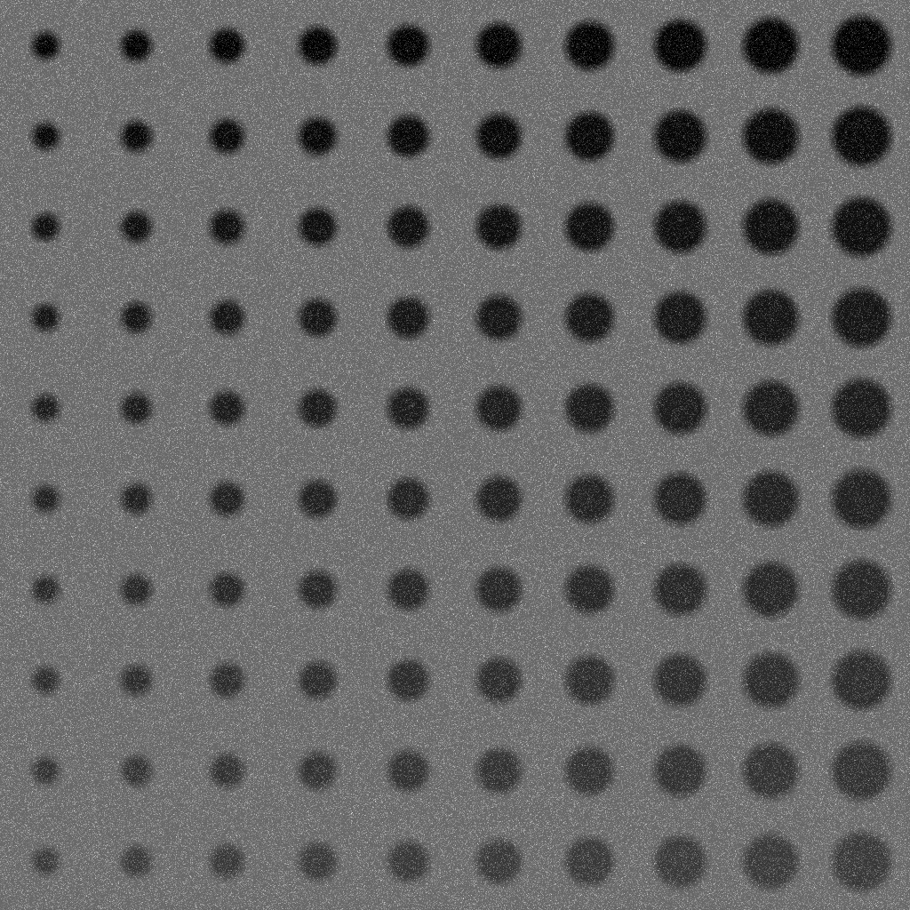
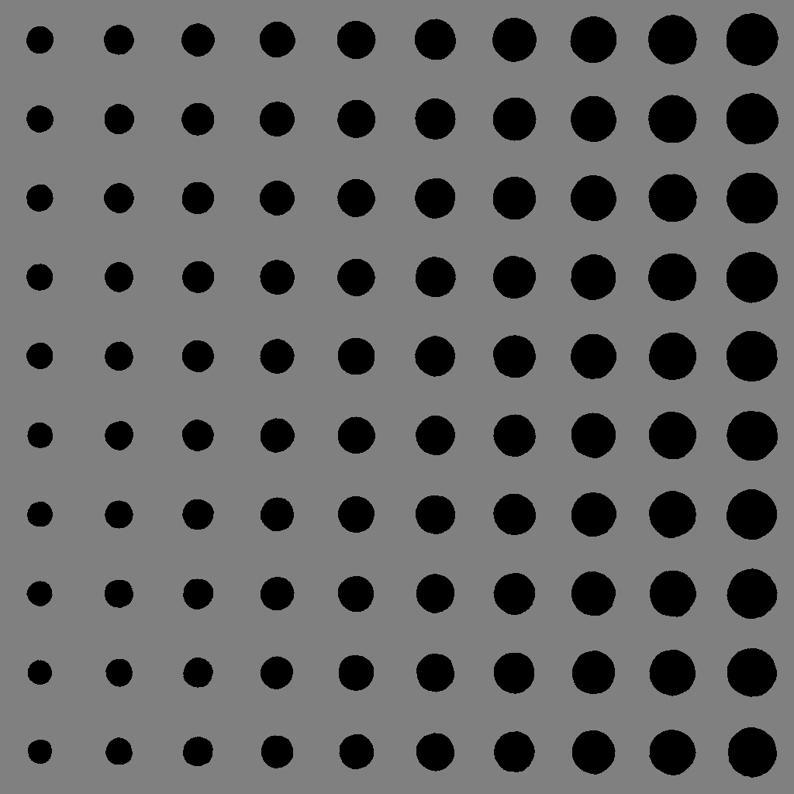
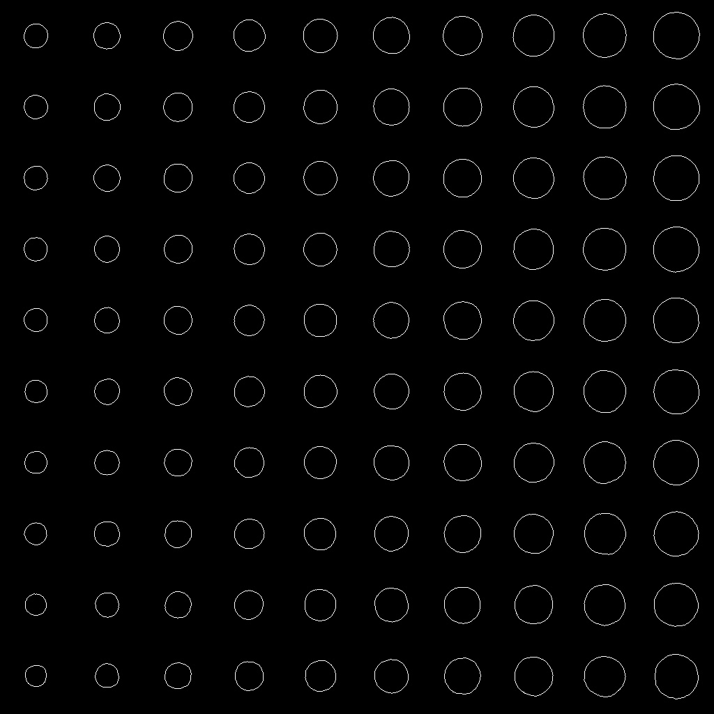

# Лабораторная 6 (детекция окружностей)

1. реализовать детектор объектов с использованием Преобразование Хафа

2. реализовать FROC анализ результатов

3. сравнить методы 4 и 6 лабораторных

# Ход работы

1) Открываем изображение и вызываем нужный метод.

```cpp
int main() {
  Mat image = imread("/home/student/projects/active/misis2024s-21-01-korepanov-g-a/prj.lab/lab06/Lab04img01.jpeg", cv::IMREAD_GRAYSCALE);
  if (image.empty()) {
    cout << "Error: Could not open image" << std::endl;
    return -1;
  }

  std::vector<cv::Vec3f> circles = houghCircles(image, 1, 10, 100, 30, 10, 30);

  return 0;
}
  

```

2) Применяем метод хафа, создаем аккумулятор, проходимся по каждому пикселю и находим границы кружка, увеличиваем значение в аккумуляторе. После этого проходимся по радиусу и по всем пикселям и проверяем найден ли кружок, если да, то добавляем. После этого рисуем найденные кружки.

```cpp
std::vector<cv::Vec3f> houghCircles(const Mat& image, double dp, double minDist, double param1, double param2, int minRadius = 0, int maxRadius = 0) {
  int width = image.cols;
  int height = image.rows;
  int size = width * height;

  Mat accumulator(size, static_cast<int>(2 * maxRadius + 1), CV_32S, cv::Scalar(0));

  for (int y = 0; y < height; y++) {
    for (int x = 0; x < width; x++) {
      if (image.at<uchar>(y, x) == 0) continue;

      for (int radius = std::max(static_cast<int>(minRadius), std::max(0, static_cast<int>(sqrt(static_cast<double>(x) * x + static_cast<double>(y) * y))));
        radius <= maxRadius; radius++) {

        for (int dx = -radius; dx <= radius; dx++) {
          int xx = x + dx;
          if (xx < 0 || xx >= width) continue;

          for (int dy = static_cast<int>(-sqrt(radius * radius - dx * dx));
            dy <= static_cast<int>(sqrt(radius * radius - dx * dx)); dy++) {

            int yy = y + dy;
            if (yy < 0 || yy >= height) continue;

            int index = static_cast<int>(yy * width + xx) + radius;
            accumulator.at<int>(index)++;
          }
        }
      }
    }
  }

  std::vector<cv::Vec3f> circles;
  for (int radius = maxRadius; radius >= minRadius; radius--) {
    for (int y = 0; y < height; y++) {
      for (int x = 0; x < width; x++) {
        int index = static_cast<int>(y * width + x) + radius;
        if (accumulator.at<int>(index) > param1) {
          bool found = false;
          for (const auto& c : circles) {
            int dx = c[0] - x;
            int dy = c[1] - y;
            if (abs(dx) <= radius && abs(dy) <= radius && sqrt(dx * dx + dy * dy) >= minDist) {
              found = true;
              break;
            }
          }
          if (!found) {
            circles.push_back(cv::Vec3f(static_cast<float>(x), static_cast<float>(y), static_cast<float>(radius)));
          }
        }
      }
    }
  }

  Mat output(image.size(), CV_8UC3, cv::Scalar(0, 0, 0));
  for (const auto& circle : circles) {
    cv::circle(output, cv::Point(static_cast<int>(circle[0]), static_cast<int>(circle[1])), static_cast<int>(circle[2]) + 1, cv::Scalar(0, 255, 0), 2);
  }

  imshow("Hough Circles", output);
  cv::waitKey(0);

  return circles;
}
  

```

Сгенерированные 3 изображения с разметкой из 4 лабораторной





