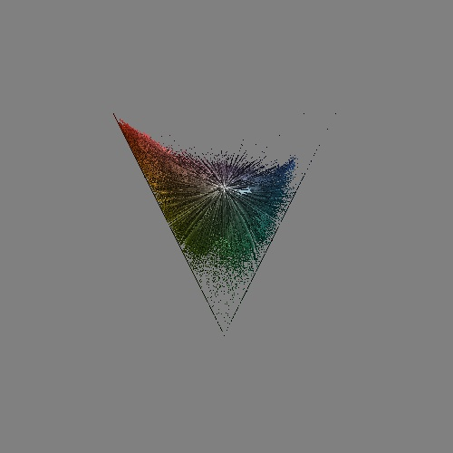

# Лабораторная 8 (визуализация цветового распреления)

1. написать консольное приложение для визуализации плотности цветового распределения в linRGB
(см. слайд 31 лекции 6, https://doi.org/10.14357/20718632210308)

# Ход работы

1) Считываем аргументы, читаем изображение и вызываем метод ```visualizePoints```.

```cpp
int main(int argc, char** argv) {
  cv::String keys = "{@||}";
  cv::CommandLineParser commandlineparser(argc, argv, keys);

  std::string imagePath = commandlineparser.get<std::string>(0);
  cv::Mat img = cv::imread(imagePath);

  std::vector<std::pair<cv::Point2f, cv::Vec3b>> coordinates = getCoordinates(img);  
  
  visualizePoints(coordinates);
  
  cv::waitKey(0);
}
  

```

2) Функция ```getCoordinates```: 
Получаем координаты, которые являются проекцией цветовых значений главной диагонали RGB куба. Проходимся по пикселям и вызываем ```sRGBtoLinRGB```.

```cpp
std::vector<std::pair<cv::Point2f, cv::Vec3b>> getCoordinates(cv::Mat& img) {
    cv::Vec3f e1(1, 0, -1);
    cv::Vec3f e2(-1, 2, -1);
    cv::normalize(e1, e1);
    cv::normalize(e2, e2);

    std::vector<std::pair<cv::Point2f, cv::Vec3b>> coordinates;
    
    cv::Vec3f new_origin(255.0f / 2, 255.0f / 2, 255.0f / 2);
    
    for (int y = 0; y < img.rows; y++) {
      for (int x = 0; x < img.cols; x++) {
        cv::Vec3b srgb = img.at<cv::Vec3b>(y, x);
        cv::Vec3f linRGB = sRGBtoLinRGB(srgb);

        double t = 1.5 * 255 / double((linRGB[0] + linRGB[1] + linRGB[2]));

        linRGB[0] = t * linRGB[0];
        linRGB[1] = t * linRGB[1];
        linRGB[2] = t * linRGB[2];

        cv::Vec3f result = linRGB - new_origin;

        float coord1 = float(e1.dot(result));
        float coord2 = float(e2.dot(result));
        coordinates.push_back(std::make_pair(cv::Point2f(coord1, coord2), srgb));
      }
    }

    return coordinates;
}
  

```

3) Функция ```sRGBtoLinRGB```: перевод из sRGB в linRGB.

```cpp
cv::Vec3f sRGBtoLinRGB(const cv::Vec3b& srgb) {
  cv::Vec3f linRGB;
  for (int i = 0; i < 3; ++i) {
    float channel = srgb[i] / 255.0f;
    if (channel <= 0.04045) {
      linRGB[i] = channel / 12.92;
    } else {
      linRGB[i] = std::pow((channel + 0.055) / 1.055, 2.4);
    }
  }
  return linRGB * 255.0f;
}
  

```

4) Функция ```visualizePoints```: 
визуализируем полученные точки. Находим макимумы и минимумы по осям и корректируем по ним расположение.

```cpp
void visualizePoints(const std::vector<std::pair<cv::Point2f, cv::Vec3b>>& points) {
    float min_x = std::numeric_limits<float>::max();
    float max_x = std::numeric_limits<float>::min();
    float min_y = std::numeric_limits<float>::max();
    float max_y = std::numeric_limits<float>::min();

    for (const auto& point : points) {
      if (point.first.x < min_x) min_x = point.first.x;
      if (point.first.x > max_x) max_x = point.first.x;
      if (point.first.y < min_y) min_y = point.first.y;
      if (point.first.y > max_y) max_y = point.first.y;
    }

    cv::Mat image(500, 500, CV_8UC3, cv::Scalar(128, 128, 128));
    
    for (const auto& point : points) {
      int x = static_cast<int>((point.first.x - min_x) * (float(image.cols) * 0.49f) / (max_x - min_x) + image.cols/4);
      int y = static_cast<int>((point.first.y - min_y) * (float(image.rows) * 0.49f) / (max_y - min_y) + image.rows/4);
      image.at<cv::Vec3b>(y, x) = point.second;
    }

    cv::imshow("Result", image);
    cv::imwrite("imageResult.jpeg", image);
}
  

```

Оригинальное изображение


2D распределение



# Пример использования

```bash
./../bin/lab08 ./../prj.lab/lab08/1.jpg
```