# Лабораторная 9


# Ход работы

1) Читаем изображение по аргументу, вызываем функцию ```checkVals```, конвертируем в linRGB, потом вызываем ```grayWorldCorrection```, переводим в SRGB и опять ```checkVals```.

```cpp
int main(int argc, char** argv) {
  cv::String keys = "{@||}";
  cv::CommandLineParser commandlineparser(argc, argv, keys);

  std::string imagePath = commandlineparser.get<std::string>(0);

  Mat image = cv::imread(imagePath);

  if (image.empty()) {
    cout << "cant open image" << std::endl;
    return -1;
  }

  cv::imshow("Preprocessed", image);

  checkVals(image, "Before correction");

  convertToLinRGB(image);
  grayWorldCorrection(image);
  convertToSRGB(image);

  cv::imwrite("lab09result.jpg", image);
  cv::imshow("result", image);

  checkVals(image, "After correction");

  cv::waitKey(0);
  return 0;
}
  

```

2) Функция ```checkVals```:
Разбиваем изображение по каналам и выводим среднеe значение, используя ```mean```.

```cpp
void checkVals(const Mat& image, const std::string& label) {
  vector<Mat> channels(3);
  split(image, channels);

  cv::Scalar meanB = mean(channels[0]);
  cv::Scalar meanG = mean(channels[1]);
  cv::Scalar meanR = mean(channels[2]);

  cout << label << "B: " << meanB[0] << " G: " << meanG[0] << " R: " << meanR[0] << std::endl;
}
  

```

3) Функция ```grayWorldCorrection```:
Опять разбиваем изображение по каналам, считаем среднеe значение, используя ```mean```, корректируем к общему уровню и объединяем.

```cpp
void grayWorldCorrection (Mat& image) {
  vector<cv::Mat> channels(3);
  cv::split(image, channels);

  cv::Scalar meanB = cv::mean(channels[0]);
  cv::Scalar meanG = cv::mean(channels[1]);
  cv::Scalar meanR = cv::mean(channels[2]);

  double meanGray = (meanB[0] + meanG[0] + meanR[0]) / 3.0;

  double scaleB = meanGray / meanB[0];
  double scaleG = meanGray / meanG[0];
  double scaleR = meanGray / meanR[0];

  channels[0] = channels[0] * scaleB;
  channels[1] = channels[1] * scaleG;
  channels[2] = channels[2] * scaleR;

  cv::merge(channels, image);
}
  

```

4) Конвертация в linRGB и в SRGB

```cpp
void convertToLinRGB(Mat& image) {
  image.convertTo(image, CV_32F, 1.0 / 255.0);
  cv::pow(image, 2.2, image);
}

void convertToSRGB(Mat& image) {
  cv::pow(image, 1.0 / 2.2, image);
  image.convertTo(image, CV_8U, 255.0);
}
  

```

Оригинал

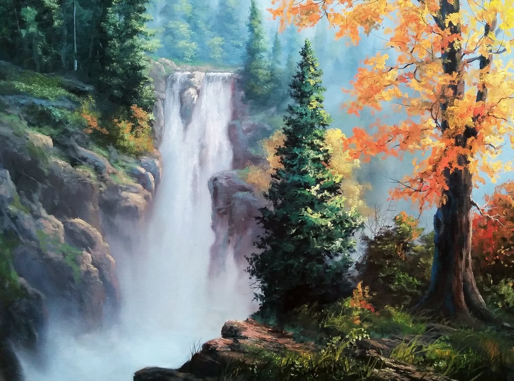

После коррекции

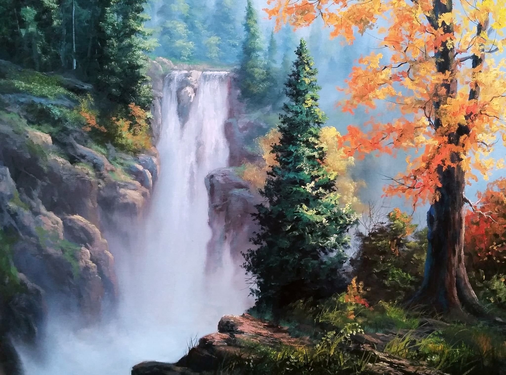

как видно, изменений не очень много
```bash
Before correctionB: 111.084 G: 118.039 R: 113.459
After correctionB: 114.184 G: 114.192 R: 114.106
```

Оригинал

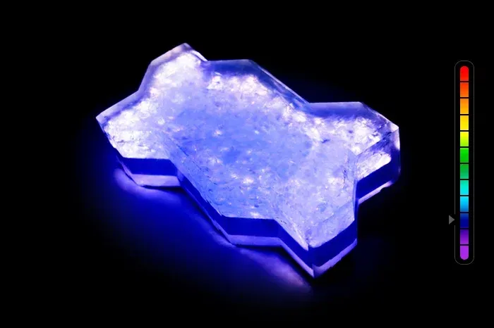

После коррекции

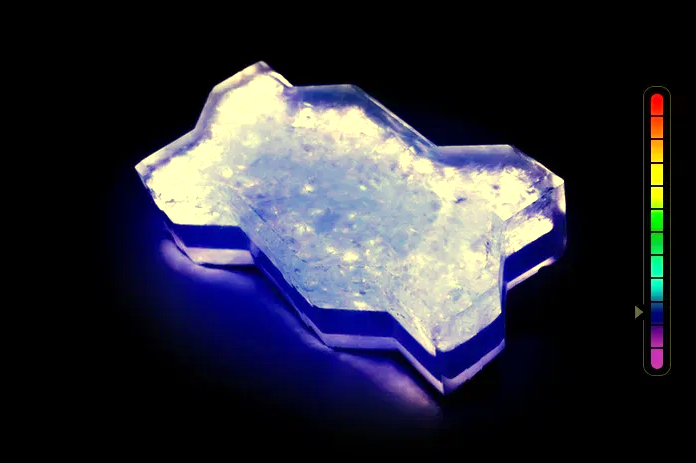

```bash
Before correctionB: 71.0876 G: 37.1394 R: 37.5507
After correctionB: 55.7659 G: 44.8016 R: 44.4254
```

Изменений больше, потому что изначально в изображении было много синего.

Оригинал

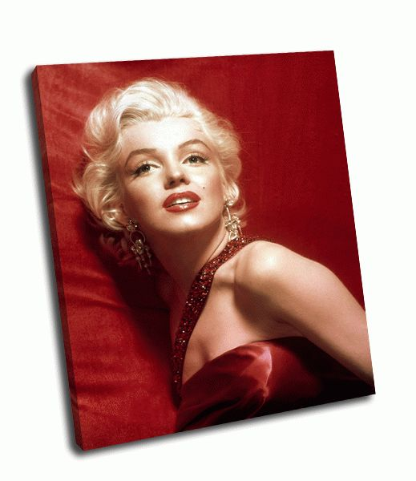

После коррекции

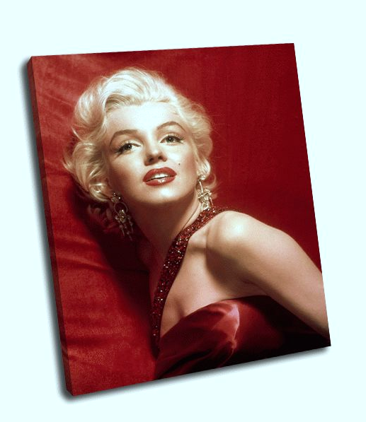

```bash
Before correctionB: 136.541 G: 140.937 R: 184.468
After correctionB: 139.997 G: 142.271 R: 172.731
```

Оригинал

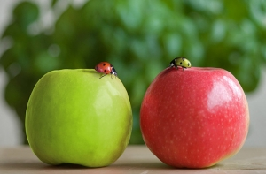

После коррекции

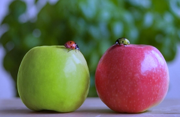

```bash
Before correctionB: 61.0865 G: 113.532 R: 118.158
After correctionB: 86.5744 G: 105.136 R: 102.785
```


Оригинал

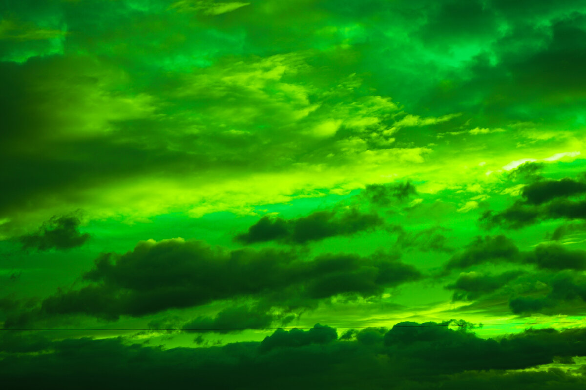

После коррекции

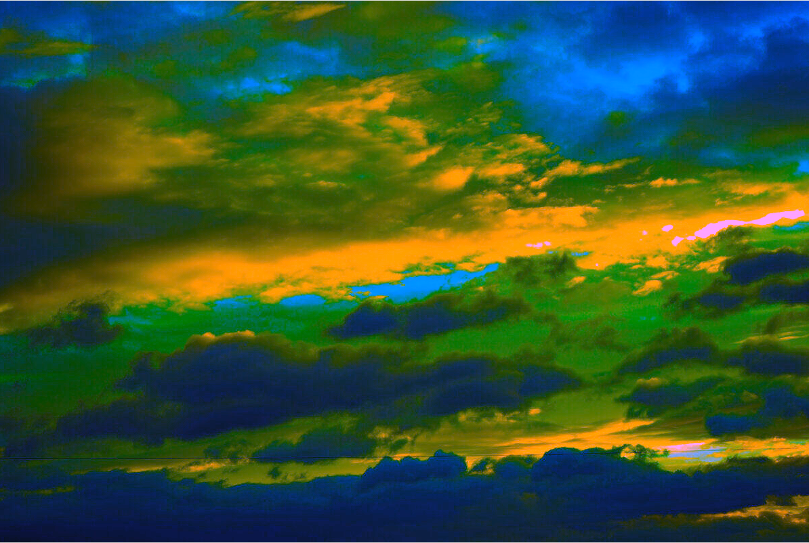

```bash
Before correctionB: 8.24732 G: 132.873 R: 31.0316
After correctionB: 49.4274 G: 84.7532 R: 53.1478
```

5) Оценка качества. В качестве эталона возьмем

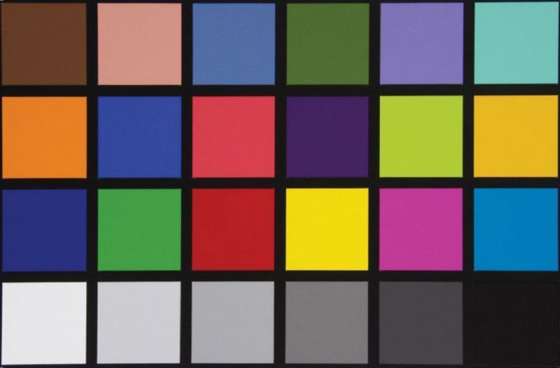

Пронумеруем квадраты

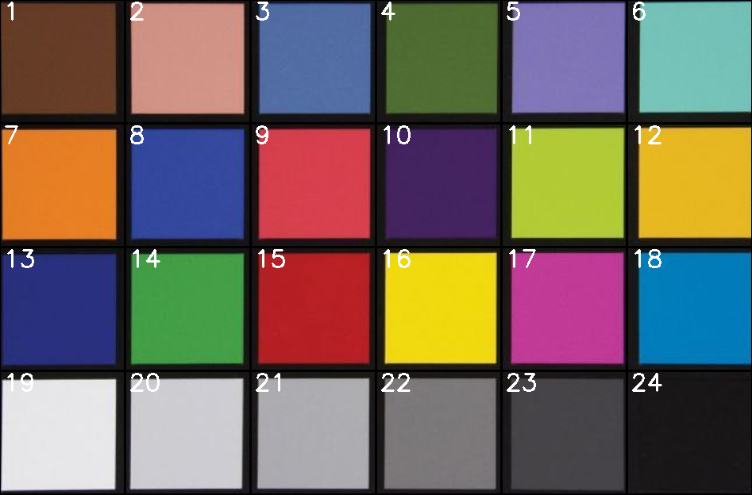

Применим коррекцию

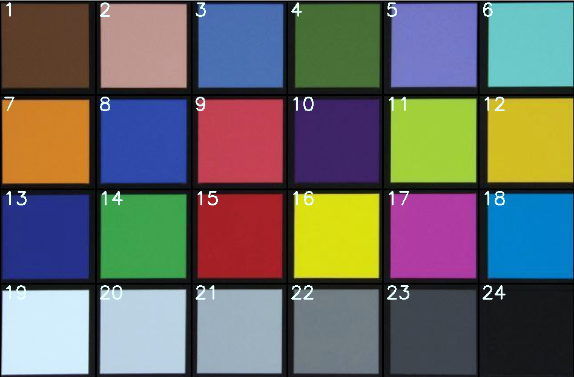


Сравним значения цветов каждого квадрата

| Номер квадрата | Цвет Эталона(BGR) | Цвет после коррекции(BGR) |
|:----|:----|:----|
|1 |34.6242 52.2806 86.1594|37.3244 54.0008 78.5294|
|2 | 110.721  120.939  171.21|119.823 124.328 155.796|
|3 | 134.194  90.0509  68.9906|145.465 92.5663 63.0062|
|4 | 44.3091  89.7684  67.0844|47.7722 92.2792 61.1409|
|5 | 150.073  97.1386  105.96|162.745 100.205 96.7377|
|6 | 150.835  158.931  97.9252|163.656 163.811 89.4012|
|7 | 33.1681  105.134  189.686|35.851 108.434 172.776|
|8 | 129.884  61.4163  45.8418|140.526 63.1337 41.5726|
|9 | 65.1281  54.4516  173.401|70.5227 56.1162 158.051|
|10 | 80.2355  33.4784  58.9719|86.7425 34.4209 53.7251|
|11 | 47.9799  165.126  145.81|51.9039 170.014 132.732|
|12 | 32.8931  151.173  188.713|35.588 155.888 171.822|
|13 | 106.568  43.6416  38.1947|115.493 44.6094 34.5721|
|14 | 61.1303  130.53  58.9953|66.1377 134.589 53.7695|
|15 | 34.2092  30.6637  149.205|36.8375 31.5591 135.999|
|16 | 19.5583  177.167  195.736|20.8942 182.693 178.533|
|17 | 124.992  51.4006  159.527|135.6 53.1103 145.423|
|18 | 154.079  104.917  8.0779|167.019 108.227 7.43196|
|19 | 193.766  191.59  192|209.983 197.35 174.849|
|20 | 171.964  167.716  168.799|186.424 172.583 153.961|
|21 | 144.453  140.826  142.103|156.555 144.905 129.715|
|22 | 102.75  101.534  104.772|110.986 104.803 95.4773|
|23 | 64.5179  60.8844  62.8204|69.6305 62.6252 57.4031|
|24 | 25.6076  24.4095  26.2632|27.5105 25.3576 24.0598|

# Пример использования
```bash
./../bin/lab09 ./../prj.lab/lab09/1.jpg
```