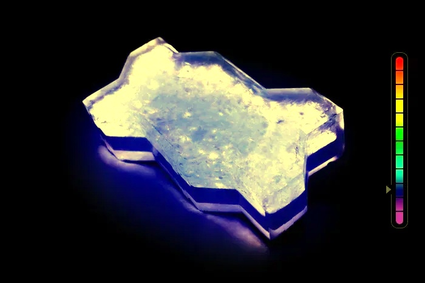

# Лабораторная 9


# Ход работы

1) Читаем изображение по аргументу, вызываем функцию ```checkVals```, потом ```grayWorldCorrection``` и опять ```checkVals```.

```cpp
int main(int argc, char** argv) {
  cv::String keys = "{@||}";
  cv::CommandLineParser commandlineparser(argc, argv, keys);

  std::string imagePath = commandlineparser.get<std::string>(0);

  Mat image = cv::imread(imagePath);
  cv::imshow("Preprocessed", image);

  checkVals(image, "Before correction");

  grayWorldCorrection(image);

  cv::imwrite("lab09result.jpg", image);
  cv::imshow("result", image);

  checkVals(image, "After correction");

  cv::waitKey(0);
}
  

```

2) Функция ```checkVals```:
Разбиваем изображение по каналам и выводим среднеe значение, используя ```mean```.

```cpp
void checkVals(const Mat& image, const std::string& label) {
  vector<Mat> channels(3);
  split(image, channels);

  cv::Scalar meanB = mean(channels[0]);
  cv::Scalar meanG = mean(channels[1]);
  cv::Scalar meanR = mean(channels[2]);

  cout << label << "B: " << meanB[0] << " G: " << meanG[0] << " R: " << meanR[0] << std::endl;
}
  

```

3) Функция ```grayWorldCorrection```:
Опять разбиваем изображение по каналам, считаем среднеe значение, используя ```mean```, корректируем к общему уровню и объединяем.

```cpp
void grayWorldCorrection (Mat& image) {
  vector<cv::Mat> channels(3);
  cv::split(image, channels);

  cv::Scalar meanB = cv::mean(channels[0]);
  cv::Scalar meanG = cv::mean(channels[1]);
  cv::Scalar meanR = cv::mean(channels[2]);

  double meanGray = (meanB[0] + meanG[0] + meanR[0]) / 3.0;

  double scaleB = meanGray / meanB[0];
  double scaleG = meanGray / meanG[0];
  double scaleR = meanGray / meanR[0];

  channels[0] = channels[0] * scaleB;
  channels[1] = channels[1] * scaleG;
  channels[2] = channels[2] * scaleR;

  cv::merge(channels, image);
}
  

```

Оригинал


После коррекции


как видно, изменений не очень много
```bash
Before correctionB: 111.084 G: 118.039 R: 113.459
After correctionB: 114.184 G: 114.192 R: 114.106
```

Оригинал


После коррекции



```bash
Before correctionB: 71.0876 G: 37.1394 R: 37.5507
After correctionB: 48.5733 G: 47.1003 R: 46.7662
```

Изменений больше, потому что изначально в изображении было много синего.

# Пример использования
```bash
./../bin/lab09 ./../prj.lab/lab09/1.jpg
```